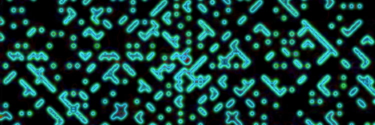
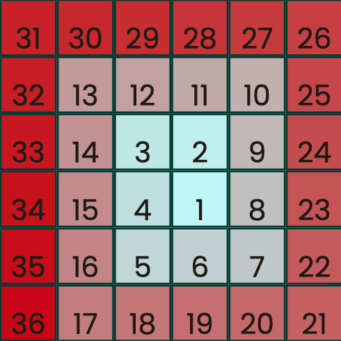
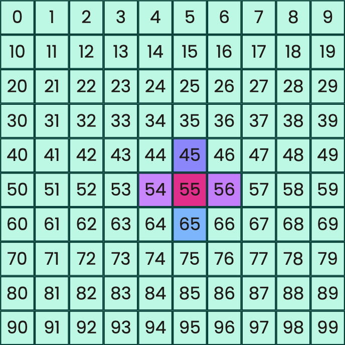
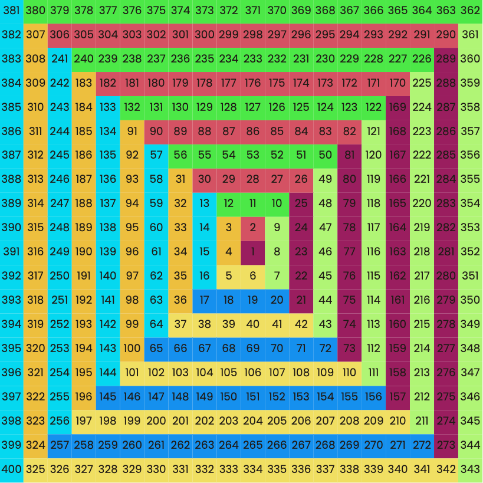

# JavaScript Ulam Spiral

### About

An Ulam spiral is a way to order the natural numbers so as to demonstrate, visually, that there are sequences with high densities of primes.

This is the repository of a project to generate an Ulam spiral with JavaScript, and to document the build process. 

The spiral itself can be found [here](https://ammersive.github.io/ulam/index.html), and the article on the build [here](https://ammersive.github.io/ulam/pages/build.html).

## Scripts

The Ulam spiral is generated from the **scripts/ulam.js** file, which appends an array of styled spans to a div container in **index.html** to form the grid.

The article about the build can be found in **pages/build.html**. This page includes a series of containers populated by further scripts which serve to illustrate different aspects of the spiral algorithm. All of the relevant scripts can be found in the **scripts/** directory.

**spiral-nums.js** generates an illustration of the way in which the natural numbers must be "printed" to the grid in a spiralling pattern:

**traversal.js** illustrates the way in which a metaphorical print head can move around to any point in a grid of spans by accessing their indexes:

**paths.js** illustrates a relationship fundamental to the spiral algorithm (the paths increase in length by one span on every other turn of the spiral):

## Styling

All the styling for the project can be found in the **styles/** directory.

Each script detailed above relies on a CSS file of the same name to set the sizes and colours of the spans themselves, as well as the size of the container to which the spans are appended. 

## Improvements

The build article details a number of improvements that can be made to this project in the future [here](https://ammersive.github.io/ulam/pages/build.html#next). For instance: optimising the project to allow for larger spirals, such as by separating the prime-computation operations from the spiral-rendering operations, and then accessing a pre-computed list of primes in the spiral algorithm.